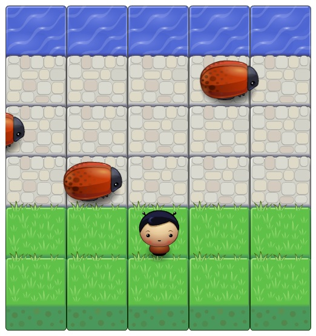

# Frogger Game Project

## Table of Contents

* [About](#About)
* [Screenshots](#Screenshots)
* [Instructions](#Instructions)

## About

* This Project is made as a part of Udacity's Front-End Development Nanodegree.
* This is a Frogger game as provided in the screenshot

## Screenshots

## Instructions

* The game starts automatically upon page load.
* Cross the road to reach the river to win.
* Avoid the Bugs while moving.
* Move the character using arrow keys.
* The game has no time limit.

### Play The Game
[Use this link to play the Game](https://compuwiser.github.io/frontend-nanodegree-arcade-game/)
